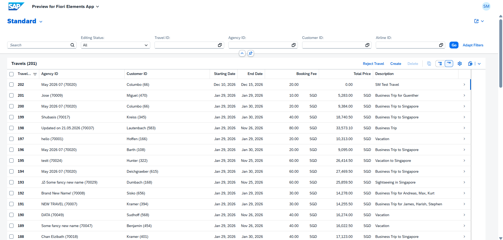
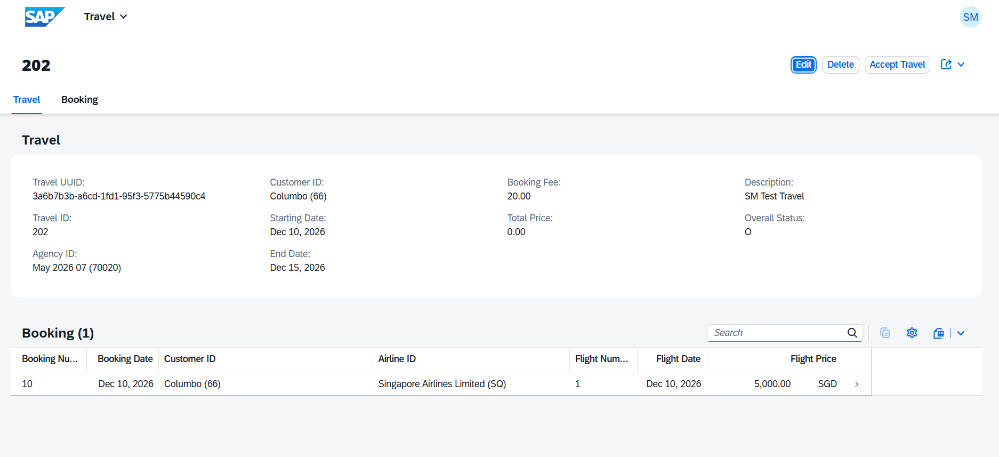
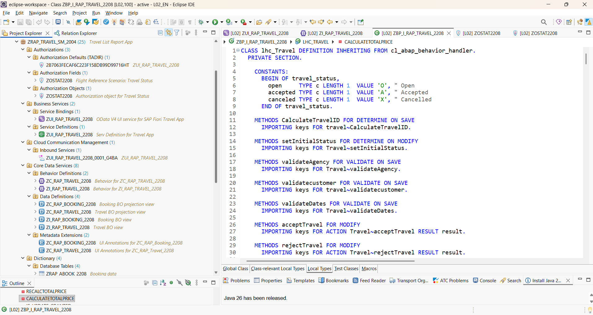

# SAP RAP Travel Management Application using ABAP Cloud & Fiori Elements

## Overview
This project is a full-stack SAP RAP (RESTful ABAP Programming Model) Travel Management Application developed using ABAP Cloud, CDS Views, OData V4, and SAP Fiori Elements.

The application demonstrates enterprise-level RAP development with managed business objects, draft handling, validations, determinations, actions, authorization implementation, and transactional processing.

## Key Features
- RAP Managed Business Object implementation
- Travel & Booking composition handling
- Draft-enabled transactional processing
- CDS Interface & Projection Views
- Behavior Definitions & Implementations
- OData V4 Service Definition & Binding
- SAP Fiori Elements UI generation
- Determinations & Validations
- Custom RAP Actions:
  - Accept Travel
  - Reject Travel
- Authorization Objects & Authorization Fields
- Metadata Extensions & UI Annotations
- Eclipse ADT-based ABAP Cloud development

## Technologies Used
- SAP ABAP Cloud
- SAP RAP
- CDS Views
- OData V4
- SAP Fiori Elements
- Eclipse ADT
- SAP BTP ABAP Environment

## Application Architecture
### Core Components
### Data Definitions
- ZI_RAP_TRAVEL_2208
- ZI_RAP_BOOKING_2208
- ZC_RAP_TRAVEL_2208
- ZC_RAP_BOOKING_2208

### Behavior Definitions
- Managed RAP BO implementation
- Draft-enabled processing
- Validations & Determinations
- Custom Actions

### Database Tables
- ZRAP_SM_2208
- ZRAP_ABOOK_2208
- ZRAP_DSM_2208
- ZRAP_DBOOK_2208

### Service Layer
- Service Definition
- OData V4 Service Binding
- Fiori Elements UI Exposure

# SAP Fiori Elements Screenshots
## Travel List Report

## Travel Object Page & Booking Details

## RAP Backend Architecture in Eclipse ADT

## Project Highlights
- Implemented enterprise RAP architecture
- Developed draft-enabled business transactions
- Created Fiori Elements UI without custom frontend coding
- Implemented RAP validations, determinations, and actions
- Applied SAP authorization concepts
- Built complete end-to-end SAP BTP ABAP Cloud application

## Author

### Sarbajeet Muduli
AI & Data Analytics | SAP RAP Developer | ABAP Cloud Enthusiast

LinkedIn:
https://www.linkedin.com/in/sarbajeetmuduli

GitHub:
https://github.com/sarbajeet12
